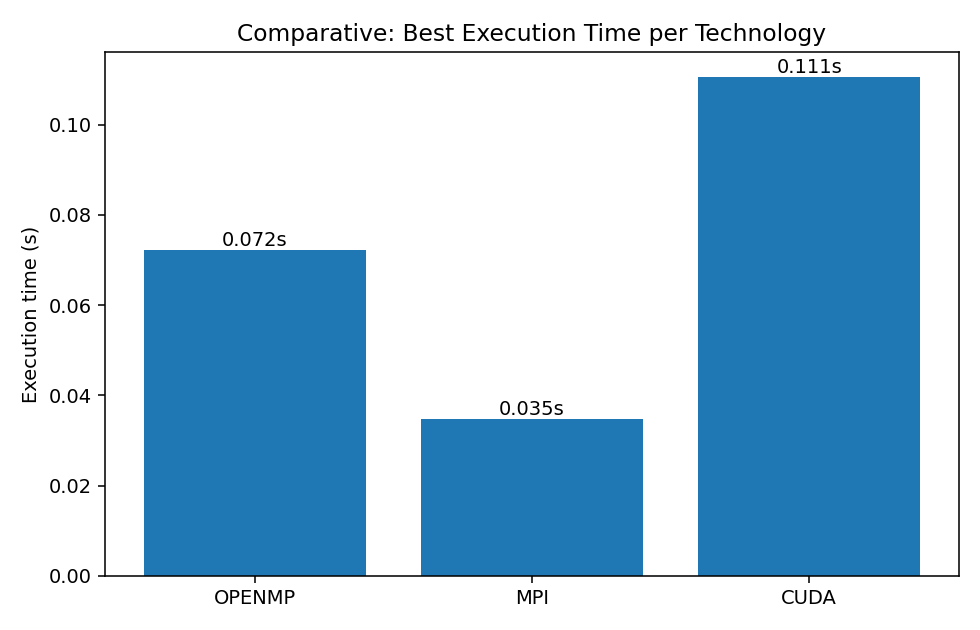
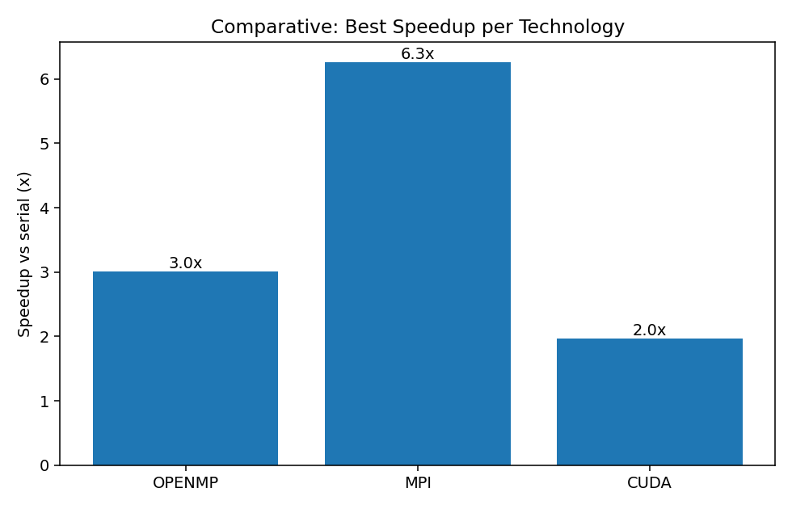
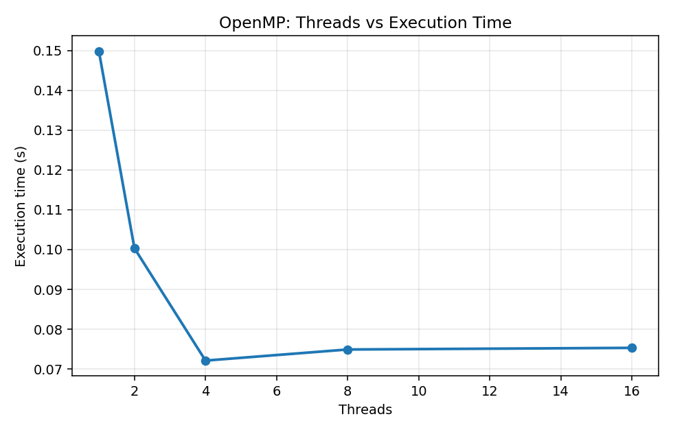
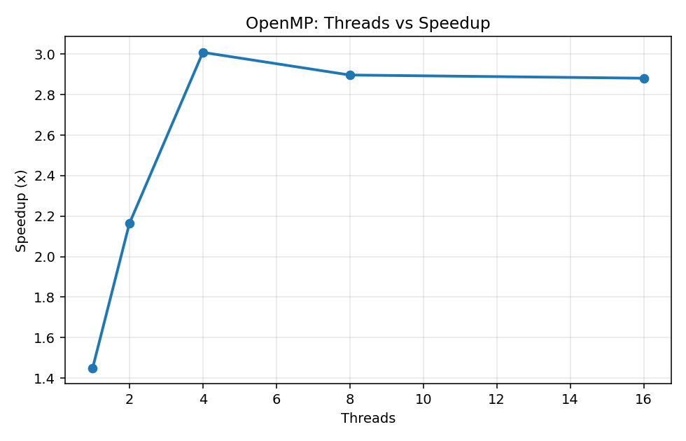
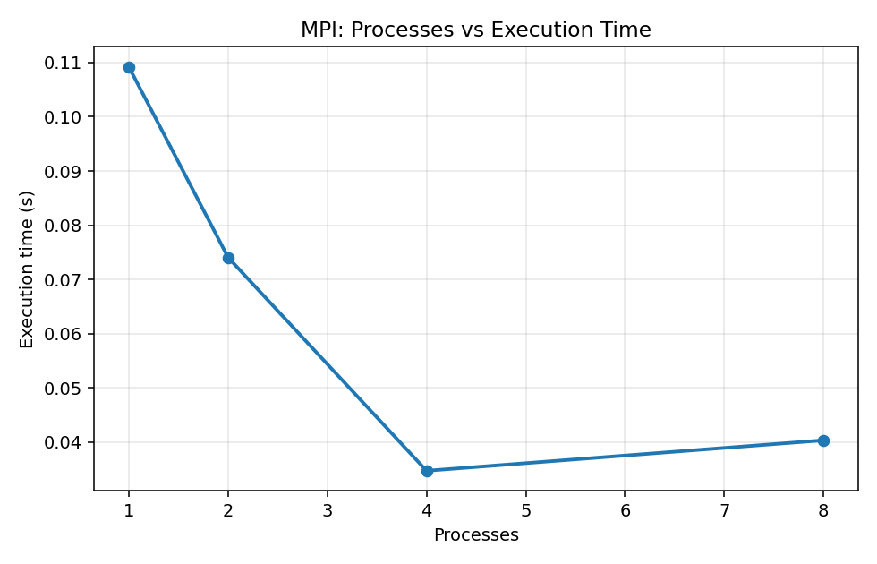
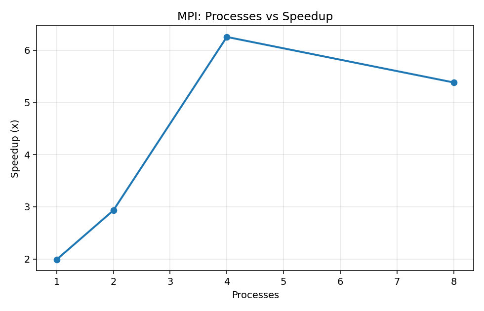
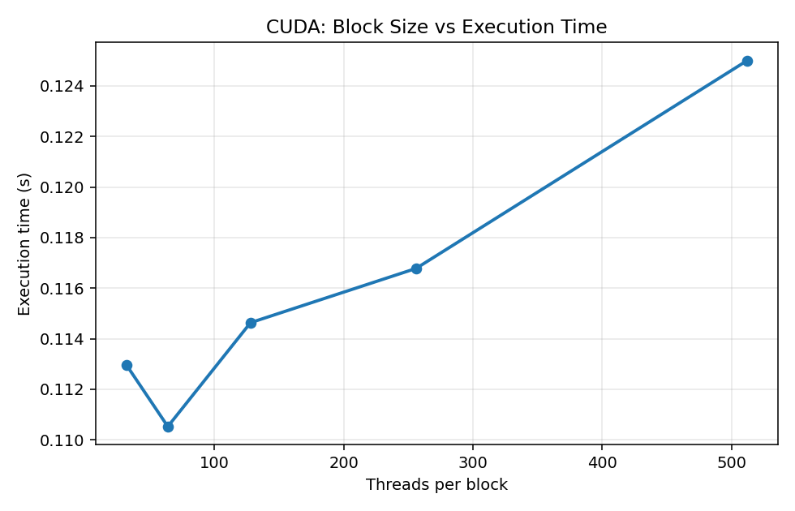
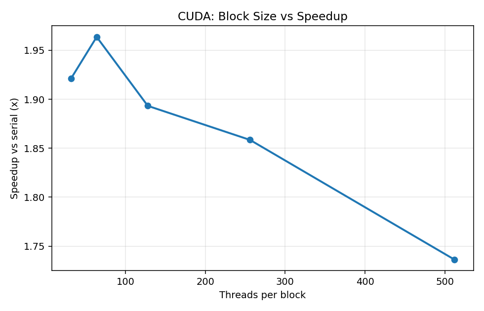

# Smith–Waterman Local Sequence Alignment — Parallel Implementations

Four implementations of the **Smith–Waterman** local sequence-alignment algorithm —
a **serial** baseline plus three parallel versions in **OpenMP**, **MPI**, and **CUDA** —
benchmarked head-to-head on the same hardware, with a shared deterministic input
generator that lets every version be cross-checked for correctness.

> **TL;DR results** (8000×8000 DNA sequences, seed `12345`): all four versions report the
> identical maximum score **3545**. Relative to the serial baseline, **MPI** wins at
> **5.20×** (16 processes), **OpenMP** reaches **2.81×** (8 threads), and **CUDA** reaches
> **2.39×** (block size 32) — the GPU being held back by per-launch overhead at this
> problem size.

---

## Table of contents

- [What this project does](#what-this-project-does)
- [The algorithm](#the-algorithm)
- [Parallelisation strategies](#parallelisation-strategies)
- [Repository layout](#repository-layout)
- [Requirements](#requirements)
- [Build](#build)
- [Run](#run)
- [Benchmark & plot](#benchmark--plot)
- [Results](#results)
- [Discussion](#discussion)
- [Limitations & potential optimisations](#limitations--potential-optimisations)
- [Sample runs & verification](#sample-runs--verification)
- [References](#references)

---

## What this project does

The Smith–Waterman algorithm (Smith & Waterman, 1981) finds the highest-scoring **local**
alignment between two sequences using dynamic programming. Its `O(m·n)` matrix-fill phase
is the natural target for parallelisation, and it is the only phase timed here (traceback
is `O(path length)` and identical across versions, so it is excluded from every
measurement).

The project parallelises that fill phase three different ways and compares them on a single
machine. The scoring scheme is the classical DNA scheme: **match = +2, mismatch = −1,
gap = −2**.

All four programs build their two input strands from the **same self-contained
xorshift-64 PRNG and seed**, so they generate byte-for-byte identical inputs across the
`gcc` and `nvcc` toolchains. Because the inputs are identical, every version **must** report
the same maximum score — this is the cross-implementation correctness check.

---

## The algorithm

Each cell of the scoring matrix `H` is computed from three neighbours plus zero:

```
H[i][j] = max( 0,
               H[i-1][j-1] + score(a[i-1], b[j-1]),   // diagonal (match / mismatch)
               H[i-1][j]   + GAP,                       // gap in sequence b
               H[i][j-1]   + GAP )                       // gap in sequence a
```

The key property every parallel version exploits is **anti-diagonal independence**: the
dependency `H[i][j] ← {H[i-1][j-1], H[i-1][j], H[i][j-1]}` is local, so all cells on the
same anti-diagonal `d = i + j` are mutually independent and can be computed in parallel —
the *wavefront* pattern.

---

## Parallelisation strategies

| Version | Strategy | Key parameter |
| --- | --- | --- |
| **Serial** | Row-major fill of the flattened `(m+1)×(n+1)` matrix; `-O2` auto-vectorises the inner loop. | — |
| **OpenMP** | Tiled anti-diagonal wavefront. | tile size `TS = 64` |
| **MPI** | Column-block partition + row-block pipeline. | row block `BR = 128` |
| **CUDA** | One kernel launch per anti-diagonal, one thread per cell. | threads/block (swept) |

**OpenMP — tiled anti-diagonal wavefront.** A naïve "one task per cell per diagonal" loop
needs `(m+n)` barriers, strides through memory cache-hostilely, and pays fork–join cost on
every diagonal. Instead the matrix is tiled into **64×64 blocks**; tiles on the same
tile-diagonal `D = ti + tj` are independent and handed out with
`#pragma omp for schedule(dynamic)` inside a single, long-lived parallel region. Each tile
is filled serially in row-major order (cache- and SIMD-friendly). This cuts the barrier
count from `~16 000` to `~251` for an 8000×8000 matrix. The running maximum is folded with
`reduction(max:max_score)`, so no atomics appear in the hot loop.

**MPI — column-block pipeline.** The `n` columns are split into `P` contiguous blocks, one
per rank; each rank keeps a local matrix plus a one-column ghost region carrying its left
neighbour's boundary. Because the recurrence reads `H[i][j-1]`, exactly one column crosses
each rank boundary per row. To avoid latency-bound per-row messaging, rows are processed in
**`BR = 128`-row blocks**: a rank receives `BR` ghost values, computes `BR` rows over all
its columns, then forwards the new boundary with a non-blocking `MPI_Isend`. Ranks overlap
in a **systolic pipeline**, and the global maximum is collected with `MPI_Reduce(MAX)`.

**CUDA — anti-diagonal kernels.** One GPU thread maps to one cell, and one kernel launch
handles one anti-diagonal. Default-stream launches execute in submission order, so diagonal
`d−1` is globally visible before `d` begins — the wavefront ordering is enforced for free,
with no `__syncthreads` or device-wide barrier. The full matrix lives in device global
memory for the whole sweep, so the only host↔device transfers are the two inputs (in) and
the single integer maximum (out). `atomicMax` maintains the running maximum, and
threads-per-block is a CLI argument so it can be swept.

---

## Repository layout

```
smith-waterman-parallel-computing/
├── source/
│   ├── serial/   serial_sw.c   + Makefile + sw_common.h   (baseline)
│   ├── openmp/   omp_sw.c      + Makefile + sw_common.h   (tiled wavefront)
│   ├── mpi/      mpi_sw.c      + Makefile + sw_common.h   (column-block pipeline)
│   └── cuda/     cuda_sw.cu    + Makefile + sw_common.h   (anti-diagonal kernels)
├── scripts/
│   ├── run_benchmarks.sh   sweeps all configs  -> data/results.csv
│   └── plot.py             builds all graphs   -> report/graphs/*.png
├── data/                   benchmark output (results.csv)
├── report/graphs/          generated performance figures
├── screenshots/            execution screenshots
├── Makefile                top-level convenience build
└── README.md
```

---

## Requirements

Tested on Ubuntu 24.04 (WSL2). You need the toolchains for whichever versions you want to
build:

```bash
sudo apt update
sudo apt install -y build-essential      # gcc + make  (serial, OpenMP)
sudo apt install -y mpich                # or: openmpi-bin libopenmpi-dev  (MPI)
# CUDA: install the NVIDIA CUDA Toolkit (gives nvcc); verify with:
#   nvcc --version   &&   nvidia-smi
pip install pandas matplotlib            # for scripts/plot.py
```

> **GPU architecture note.** `source/cuda/Makefile` sets `-arch=sm_89` (Ada / RTX 40-series).
> If your toolkit rejects it, change it to a value your toolkit supports (e.g. `sm_86`) or
> drop the `-arch` line and let `nvcc` pick a default.

---

## Build

```bash
make             # builds serial, openmp, mpi, cuda
make cpu         # only serial + openmp (if MPI/CUDA aren't installed yet)

# or one at a time:
make -C source/serial
make -C source/openmp
make -C source/mpi
make -C source/cuda

make clean       # remove all built binaries
```

---

## Run

Every program prints a `Max score` line (identical across all four for the same
`m`/`n`/seed), a `Fill time` line, and a machine-readable `CSV,...` line consumed by the
benchmark/plot scripts.

```bash
#                                       m    n    seed
# Serial baseline
./source/serial/serial_sw              8000 8000 12345

# OpenMP — thread count via env var (or 4th arg)
OMP_NUM_THREADS=8 ./source/openmp/omp_sw 8000 8000 12345
./source/openmp/omp_sw                 8000 8000 12345 8

# MPI — process count via -np
mpirun -np 4 ./source/mpi/mpi_sw       8000 8000 12345

# CUDA — 4th arg is threads-per-block
./source/cuda/cuda_sw                  8000 8000 12345 256
```

---

## Benchmark & plot

```bash
# Sweeps OpenMP threads {1,2,4,8,16}, MPI processes {1,2,4,8,16},
# CUDA block sizes {32,64,128,256,512}, 3 reps each -> data/results.csv
./scripts/run_benchmarks.sh 8000 8000 12345

# Build every figure into report/graphs/
python3 scripts/plot.py
```

Speedup is reported as `T_serial / T_parallel`, using the averaged serial fill-time as the
baseline. Each configuration is run 3 times so the plotting script can average out OS noise.

---

## Results

**Test platform**

| Component | Specification |
| --- | --- |
| CPU | Intel Core i7-13650HX (Raptor Lake-HX) — 10 cores (6P + 4E), 20 threads |
| GPU | NVIDIA GeForce RTX 4060 Laptop (Ada Lovelace, sm_89), 8 GB GDDR6 |
| Memory | 7.6 GiB available to the WSL2 guest |
| OS | Ubuntu 24.04 under WSL2 on Windows |
| Toolchains | gcc 15.2 · MPICH · nvcc (CUDA 12.4) |

**Averaged execution times (3 runs each), 8000×8000, seed 12345.** Every run reports
`Max score = 3545`, confirming correctness.

| Implementation | Configuration | Avg time (s) | Speedup |
| --- | --- | ---: | ---: |
| Serial baseline | 1 thread | 0.2490 | 1.00× |
| OpenMP | 1 thread | 0.1873 | 1.33× |
| OpenMP | 2 threads | 0.1528 | 1.63× |
| OpenMP | 4 threads | 0.0920 | 2.71× |
| **OpenMP (best)** | **8 threads** | **0.0886** | **2.81×** |
| OpenMP | 16 threads | 0.0937 | 2.66× |
| MPI | 1 process | 0.1539 | 1.62× |
| MPI | 2 processes | 0.0826 | 3.01× |
| MPI | 4 processes | 0.0493 | 5.05× |
| MPI | 8 processes | 0.0481 | 5.17× |
| **MPI (best)** | **16 processes** | **0.0479** | **5.20×** |
| **CUDA (best)** | **block = 32** | **0.1043** | **2.39×** |
| CUDA | block = 64 | 0.1142 | 2.18× |
| CUDA | block = 128 | 0.1109 | 2.25× |
| CUDA | block = 256 | 0.1143 | 2.18× |
| CUDA | block = 512 | 0.1090 | 2.28× |

### Comparison

| Best time per implementation | Best speedup per implementation |
| --- | --- |
|  |  |

### OpenMP

| Execution time vs threads | Speedup vs threads |
| --- | --- |
|  |  |

### MPI

| Execution time vs processes | Speedup vs processes |
| --- | --- |
|  |  |

### CUDA

| Kernel time vs block size | Speedup vs block size |
| --- | --- |
|  |  |

---

## Discussion

**OpenMP** delivers a solid 2.81× at 8 threads, then plateaus and slightly regresses at 16.
Three forces flatten the curve: (i) the CPU is heterogeneous (6 fast P-cores + 4 slower
E-cores), so threads beyond the sixth contribute less; (ii) the wavefront imposes
`(TR+TC−1)` implicit barriers whose per-barrier wait grows relative to per-tile work; and
(iii) a memory-bound integer kernel gains little from hyper-threading.

**MPI** is the surprise winner on a single laptop. Each rank is a separate process, which
means no cross-thread false sharing, free pinning of each process to its own physical core,
and long contiguous memory strides the prefetcher loves. It scales near-linearly to 4
processes (5.05×) then plateaus around 5.2× as communication latency and core
oversubscription cap the gains.

**CUDA** is a clean case study in **launch-overhead-bound** kernels. An 8000×8000 matrix
issues `m + n − 1 = 15 999` kernel launches, one per anti-diagonal; at ~5–10 µs of driver
overhead each, cumulative launch latency (≈80–150 ms) is comparable to the actual compute.
Worse, the short diagonals near the corners leave most threads idle. The block-size sweep is
therefore nearly flat (0.099–0.114 s); block = 32 wins narrowly, within run-to-run noise.

**Takeaway.** At *this* problem size on *this* laptop, MPI wins because the workload is too
small to amortise GPU launch overhead and too bandwidth-bound to benefit from SMT. Scale the
sequences up one or two orders of magnitude and the picture inverts: each anti-diagonal would
carry enough work to dwarf launch cost, and the GPU's thousands of cores would dominate.
OpenMP remains the most portable and easiest to deploy, scaling sub-linearly here mainly
because of the hybrid core mix rather than any OpenMP shortcoming.

---

## Limitations & potential optimisations

- **OpenMP** — saturates at 8 threads on the hybrid P/E-core CPU. Pin threads to the P-cores
  (`OMP_PROC_BIND=close`, `OMP_PLACES=cores`) to avoid migration onto E-cores, and try a
  larger tile (`TS = 128`) to push the barrier count down further.
- **MPI** — plateaus at 4–8 processes as per-rank work shrinks faster than pipeline fill
  time. A hierarchical block size (small blocks to fill the pipeline fast, growing larger for
  better amortisation) could help.
- **CUDA** — launch-overhead-bound at this size. A persistent-thread design that processes
  many anti-diagonals inside one kernel (cooperative groups / grid-wide sync) would eliminate
  ~16 000 launches; a tiled shared-memory wavefront (multiple cells per thread) would raise
  arithmetic intensity above the launch-cost floor.

---

## Sample runs & verification

Each implementation was run 3× per configuration; every run reports the same
`Max score = 3545`, which is the cross-implementation correctness check. Full terminal
captures are in [`screenshots/`](screenshots/).

<details>
<summary><strong>Environment</strong> — CPU / GPU / toolchains</summary>


</details>

<details>
<summary><strong>Serial</strong> baseline</summary>


</details>

<details>
<summary><strong>OpenMP</strong> — threads 1 → 16</summary>


</details>

<details>
<summary><strong>MPI</strong> — processes 1 → 16</summary>


</details>

<details>
<summary><strong>CUDA</strong> — block sizes 32 → 512</summary>


</details>

---

## References

1. T. F. Smith and M. S. Waterman, "Identification of common molecular subsequences,"
   *Journal of Molecular Biology*, vol. 147, no. 1, pp. 195–197, 1981.
2. L. Dagum and R. Menon, "OpenMP: An industry standard API for shared-memory programming,"
   *IEEE Computational Science and Engineering*, vol. 5, no. 1, pp. 46–55, 1998.
3. Message Passing Interface Forum, *MPI: A Message-Passing Interface Standard, Version 4.0*,
   2021.
4. NVIDIA Corporation, *CUDA C++ Programming Guide*, version 12.4, 2024.
   <https://docs.nvidia.com/cuda/cuda-c-programming-guide/>
5. S. Aluru, *Handbook of Computational Molecular Biology*, Chapman & Hall/CRC, 2005.
6. G. M. Amdahl, "Validity of the single processor approach to achieving large scale
   computing capabilities," in *Proc. AFIPS Spring Joint Computer Conference*, 1967,
   pp. 483–485.
